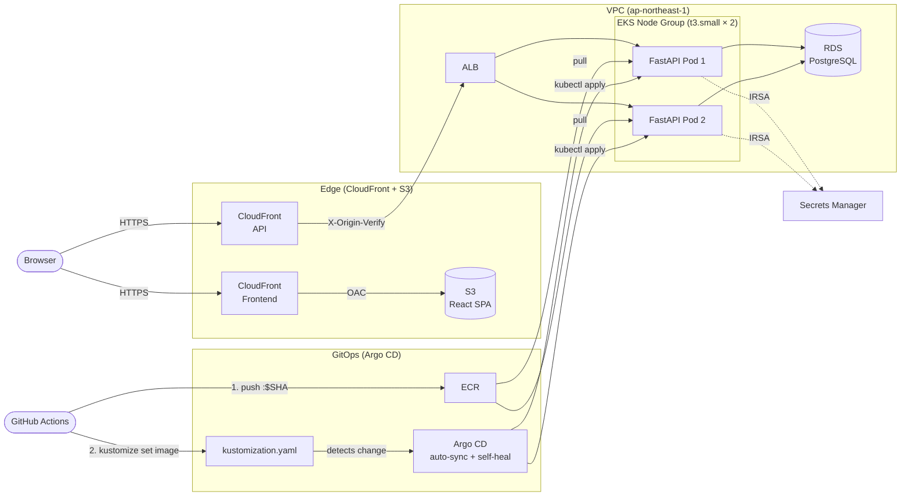

# Membership Blog on EKS

[日本語版 README はこちら](README.ja.md)

A production-ready, secure, and scalable membership blog system built on AWS EKS (Kubernetes).
All infrastructure layers are managed with Terraform, and continuous delivery is achieved through GitOps with Argo CD.

## Architecture



| Layer | Technology |
|---|---|
| Frontend | React (Vite) + S3 + CloudFront (OAC) |
| Backend | FastAPI (Python 3.12) on EKS Managed Node Groups |
| Database | Amazon RDS for PostgreSQL (Private Subnet) |
| Networking | VPC, ALB via AWS Load Balancer Controller, Route53, ACM |
| Security | IRSA, ACM (TLS 1.2+), AWS Secrets Manager, custom origin header |
| GitOps | Argo CD (automated sync + self-heal) |
| IaC | Terraform (fully modular) |
| CI/CD | GitHub Actions (OIDC — no stored AWS credentials) |

---

## Architecture Decision Records

### ADR 1 — Kubernetes (EKS) over ECS Fargate

**Context**

AWS ECS Fargate and EKS both run containerized workloads on AWS, but their operational models differ significantly. ECS is simpler and cheaper; EKS provides the full Kubernetes API surface.

**Decision**

Use EKS Managed Node Groups to demonstrate production Kubernetes operations: rolling updates, liveness/readiness probes, Kustomize-based configuration management, and GitOps with Argo CD.

**Trade-offs accepted**

- EKS adds ~$73/month for the control plane plus EC2 node costs — roughly 3× the cost of an equivalent ECS Fargate setup. For a non-high-traffic application, this is a deliberate choice to exercise enterprise-grade tooling rather than minimize spend.
- ECS requires less operational knowledge. EKS is the right choice when the goal is to build fluency with Kubernetes primitives (Deployments, Services, Ingress, Kustomize overlays).

---

### ADR 2 — GitOps with Argo CD (Git as the Single Source of Truth)

**Context**

A conventional CI/CD pipeline pushes changes directly to the cluster from CI (`kubectl apply` or `helm upgrade`). This works but means the live cluster state can drift from what is in version control.

**Decision**

Use Argo CD to manage the cluster state. GitHub Actions builds and pushes the Docker image, then commits the new image tag into `k8s/overlays/dev/kustomization.yaml`. Argo CD detects the manifest change and reconciles the cluster to match.

1. `git push` → GitHub Actions builds image → pushes to ECR with `:$GITHUB_SHA` tag
2. GitHub Actions runs `kustomize edit set image` → commits updated `kustomization.yaml` to `main`
3. Argo CD polls the repository, detects the new tag, runs `kubectl apply`
4. If the live cluster ever drifts from Git (e.g., manual `kubectl` command), Argo CD's **self-heal** reverts it automatically

**Trade-offs accepted**

- The pipeline has an extra step (a Git commit) compared to a direct `kubectl apply`. This overhead is worthwhile: every deployment is a Git commit, giving a full audit trail and one-command rollback (`git revert`).

---

### ADR 3 — IRSA for Pod-Level AWS Access (No Node Instance Profiles)

**Context**

Kubernetes pods running on EC2 nodes can inherit the node's IAM instance profile. This is simple but violates least-privilege: every pod on the node shares the same permissions.

**Decision**

Use IAM Roles for Service Accounts (IRSA) to bind an IAM role to a specific Kubernetes Service Account. Only pods that use that Service Account can assume the role.

- The IAM role trusts the EKS OIDC provider as a federated identity
- Terraform provisions the OIDC provider, the IAM role, and the `ServiceAccount` annotation in a single module
- The FastAPI pod assumes the role to read secrets from Secrets Manager — no other pod on the node can do the same

**Trade-offs accepted**

- IRSA requires configuring an OIDC provider and annotating Service Accounts — more setup than node profiles. This complexity is standard practice in production EKS clusters and is fully automated by the Terraform module.

---

### ADR 4 — CloudFront Custom Header to Block Direct ALB Access

**Context**

The ALB has a public DNS hostname. Without additional protection, anyone who discovers this hostname can bypass CloudFront — circumventing WAF rules, TLS policies, and geographic restrictions applied at the CDN layer.

**Decision**

CloudFront injects a custom header (`X-Origin-Verify: <uuid>`) on every request. The FastAPI application validates this header in a middleware layer before any route handler runs. The secret is generated by Terraform and stored in Secrets Manager; the pod fetches it at startup via IRSA.

**Trade-offs accepted**

- This is a shared-secret pattern, not mutual TLS. It is operationally simpler and sufficient for this threat model. The secret rotates on each `terraform apply`.

---

## Repository Structure

```
.
├── terraform/
│   ├── bootstrap/          # S3 backend, Route53 hosted zone
│   ├── envs/dev/           # Environment entrypoint (main.tf, variables.tf)
│   └── modules/            # Reusable modules
│       ├── vpc/            # VPC, subnets, security groups
│       ├── eks/            # EKS cluster, node group, IRSA OIDC provider
│       ├── rds/            # RDS PostgreSQL
│       ├── ecr/            # ECR repository
│       ├── acm/            # ACM certificates
│       ├── cloudfront/     # CloudFront distributions
│       ├── frontend/       # S3 bucket + CloudFront OAC for React
│       └── iam_oidc/       # GitHub Actions OIDC IAM role
├── k8s/
│   ├── base/               # Deployment, Service, Ingress (environment-agnostic)
│   └── overlays/
│       └── dev/            # Kustomize patches: replicas, image tag, ConfigMap
├── app/                    # FastAPI backend (Python 3.12)
│   ├── routers/            # Auth, Posts
│   ├── services/           # Business logic
│   ├── core/config.py      # Settings (pydantic-settings)
│   ├── Dockerfile          # Multi-stage build
│   └── tests/              # pytest test suite
├── frontend/               # React (Vite) frontend
├── argocd/                 # Argo CD Application manifest
├── .github/workflows/
│   ├── infra-deploy.yml    # Test → Build → Push ECR → Update manifest → Argo CD sync
│   └── frontend-deploy.yml # Build → S3 sync → CloudFront invalidation
├── setup-all.sh            # Automated full infrastructure setup script
└── destroy-all.sh          # Safe full teardown script
```

---

## CI/CD Pipeline

### Backend (`app/**` push to `main`)

```
Push to main
    │
    ▼
[test]  pytest (Python 3.12)
    │
    ▼ (on success)
[deploy]
    ├── Configure AWS (OIDC)
    ├── docker build & push → ECR (tagged with git SHA)
    ├── kustomize edit set image (updates kustomization.yaml)
    └── git commit & push → triggers Argo CD sync
```

### Frontend (`frontend/**` push to `main`)

```
Push to main
    │
    ▼
[front-deploy]
    ├── npm ci & build (Vite)
    ├── Configure AWS (OIDC)
    ├── aws s3 sync → S3
    └── CloudFront cache invalidation
```

---

## Security Highlights

| Concern | Implementation |
|---|---|
| No stored AWS credentials | GitHub Actions OIDC → IAM role assumption |
| Pod-level AWS access | IRSA (per-service-account IAM roles) |
| Secret management | AWS Secrets Manager + Kubernetes Secrets (injected as env vars) |
| ALB direct-access bypass | `X-Origin-Verify` custom header validated in FastAPI middleware |
| TLS everywhere | ACM certificates, CloudFront enforces HTTPS redirect, TLS 1.2+ minimum |
| Private database | RDS in private subnets, no public endpoint |

---

## Testing

Unit tests cover all API endpoints using FastAPI's `TestClient` with an in-memory SQLite database — no running PostgreSQL or Kubernetes cluster required.

```bash
cd app
python -m venv .venv && source .venv/bin/activate
pip install -r requirements-dev.txt
pytest tests/ -v
```

| Test Class | Cases | Coverage |
|---|---|---|
| `TestHealth` | 1 | 200 response |
| `TestRegister` | 3 | Success, duplicate email, invalid format |
| `TestLogin` | 3 | Success, wrong password, unknown user |
| `TestPosts` | 4 | List, authenticated create, unauthenticated create (401), post appears in list |
| `TestDeletePost` | 5 | Owner, other user (403), admin, non-existent (404), unauthenticated (401) |

The `TestDeletePost` suite explicitly verifies authorization boundaries: a non-owner receives `403 Forbidden`, while an admin can delete any post. These cases directly test the role-based access rules defined in the service layer.

---

## Estimated Monthly Cost (ap-northeast-1)

EKS carries a higher baseline cost than ECS Fargate — primarily the control plane fee and EC2 node instances. The trade-off is the full Kubernetes API surface, GitOps with Argo CD, and IRSA-based least-privilege access.

| Service | Spec | Cost |
|---|---|---|
| EKS Cluster | Control plane | ~$73/month |
| EC2 (Node Group) | t3.small × 2 (on-demand) | ~$15/month |
| ALB | 1 load balancer | ~$16/month |
| RDS PostgreSQL | db.t3.micro / 20 GB | ~$22/month |
| CloudFront | 2 distributions | ~$1/month |
| Route 53 | 1 hosted zone | $0.50/month |
| Secrets Manager | 1 secret (DB) | $0.40/month |
| ECR | Image storage | ~$0.50/month |
| S3 | Static assets | ~$0.50/month |
| CloudWatch + other | Logs, alarms | ~$2/month |
| **Total** | | **~$131/month** |

For a cost-optimized alternative using ECS Fargate with ALB and NAT Gateway eliminated, see [membership-site-on-ecs](https://github.com/kamotaka-0426/membership-site-on-ecs) (~$44/month).

---

## Deploy Guide

### Prerequisites
- AWS CLI configured with a profile named `dev-infra-01`
- Terraform >= 1.9, kubectl, Helm 3

### Automated Setup (Recommended)

Use the setup script to provision all infrastructure in the correct order:

```bash
# 1. Copy and fill in your Terraform variables
cp terraform/envs/dev/terraform.tfvars.example terraform/envs/dev/terraform.tfvars

# 2. Run the setup script
./setup-all.sh
```

The script performs the following steps automatically:
1. Checks that all required tools are installed (`terraform`, `kubectl`, `helm`, `aws`)
2. Deploys the bootstrap layer (S3 state backend, DynamoDB lock table, Route53 hosted zone)
3. Displays the Route53 name servers and pauses — register these at your domain registrar before continuing
4. First `terraform apply`: provisions VPC, EKS, RDS, ECR, ACM, and Argo CD (excluding CloudFront)
5. Waits for Argo CD to sync and the ALB to become available (up to 10 minutes)
6. Second `terraform apply`: provisions CloudFront and the frontend S3 bucket
7. Prints the values needed for GitHub Actions Secrets and the access URLs

> **Note:** The script stops immediately on any error and displays a failure message. If it fails mid-way, check the AWS console for any partially created resources before re-running.

### Manual Setup

<details>
<summary>Click to expand manual steps</summary>

#### Step 1 — Bootstrap (S3 state backend + Route53)
```bash
cd terraform/bootstrap
terraform init && terraform apply
```

After applying, register the displayed Route53 name servers at your domain registrar.

#### Step 2 — Core Infrastructure (EKS, RDS, Argo CD)
```bash
cd terraform/envs/dev
cp terraform.tfvars.example terraform.tfvars  # fill in your values
terraform init
# First pass: deploy EKS and Argo CD before CloudFront can resolve the ALB hostname
terraform apply -target=module.vpc \
                -target=module.eks \
                -target=module.rds \
                -target=module.ecr \
                -target=helm_release.argocd \
                -target=kubernetes_manifest.argocd_app
# Wait for Argo CD to sync and create the ALB (check: kubectl get ingress -n dev)
# Second pass: deploy CloudFront with the resolved ALB hostname
terraform apply
```

</details>

### Step 3 — CI/CD Secrets (GitHub Actions)

Set the following repository secrets in GitHub:

| Secret | Description |
|---|---|
| `AWS_ROLE_ARN` | IAM role ARN output from `terraform output github_actions_role_arn` |
| `ECR_REPOSITORY` | ECR repository name |
| `S3_BUCKET_NAME` | Frontend S3 bucket name |
| `CLOUDFRONT_DISTRIBUTION_ID` | CloudFront distribution ID for the frontend |
| `VITE_API_URL` | Backend API URL (e.g. `https://api.example.com`) |

When using `setup-all.sh`, most of these values are printed automatically at the end of the script.

Push to `main` to trigger the pipeline.

---

## Teardown

```bash
./destroy-all.sh
```

The script performs teardown in the correct order to avoid dependency errors:
1. Deletes all Argo CD Applications (triggers ALB deletion via the Load Balancer Controller)
2. Waits for the ALB to be fully removed from AWS
3. Runs `terraform destroy` on the main infrastructure (`envs/dev`)
4. Runs `terraform destroy` on the bootstrap layer

> **Note:** The script stops immediately on any error and displays a failure message, so a successful "🎉 All resources have been successfully deleted." message confirms full teardown.
>
> **If the script fails mid-way** (some resources deleted, some remaining), simply re-run `./destroy-all.sh`. Terraform reads the state file to determine what still exists and will only attempt to destroy the remaining resources — it is safe to re-run.

---

**Author:** Takayuki Kotani ([GitHub](https://github.com/kamotaka-0426))
